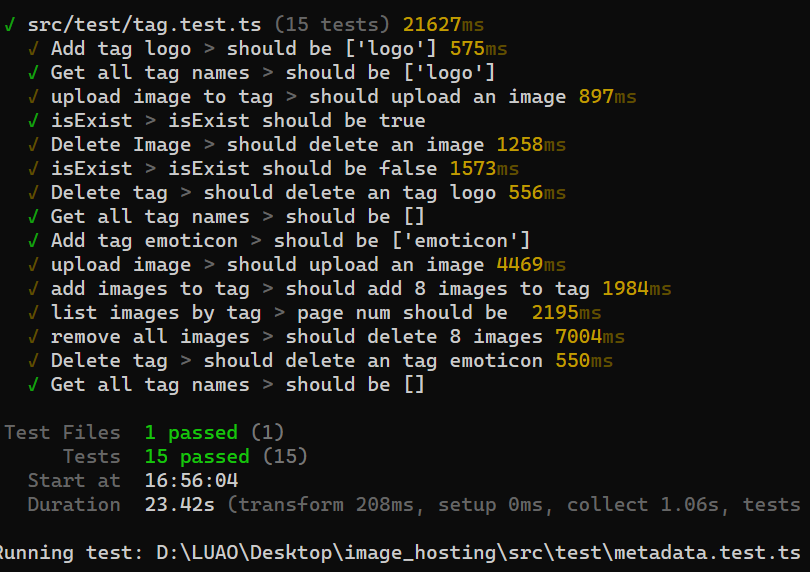

# S3ImageHosting


> 纯前端、浏览器可用、超轻量的基于对象存储的图床管理工具

<table style="width: 100%;" align="center">
  <tr>
    <td colspan="2" align="center">
      <h2>目录</h2>
    </td>
  </tr>
  <tr>
    <td style="text-align: left; display: inline-block;">
      <p><a href='#特性-🚀'>特性 🚀</a></p>
      <p><a href='#测试结果-✅'>测试结果 ✅</a></p>
      <p><a href='#使用方法-📚'>使用方法 📚</a></p>
      <p><a href='#警告-⚠️'>警告 ⚠️</a></p>
      <p><a href='#开发贡献-🛠️'>开发&贡献 🛠️</a></p>
      <p><a href='#协议授权-📄'>协议&授权 📄</a></p>
      <p><a href='#鸣谢-🙏'>鸣谢 🙏</a></p>
    </td>
  </tr>
</table>

## 特性 🚀

1. [纯前端，浏览器可用](#纯前端浏览器可用)
2. [超轻量](#超轻量)
3. [高扩展](#高扩展)
4. [功能全面](#功能全面)
5. [多种服务支持](#多种服务支持)
6. [TypeScript 类型齐全](#typescript-类型齐全)
7. [注释详尽](#注释详尽)
8. [完整测试用例](#完整测试用例)
9. [模块化设计](#模块化设计)

### 纯前端，浏览器可用

纯前端语言编写，可直接在浏览器中调用，无需后端支持，无需配置复杂服务器。

### 超轻量

只提供基础的接口包装，未压缩前体积仅 **42.54KB**，加载速度快，性能优异。

### 高扩展

区别于传统图床项目，该库仅是**针对性**地将对象储存包装为了可以方便使用的图床相关的实用接口，开发者可以根据需要自由扩展和定制功能，以满足特定的业务需求。用户也不必担心迁移平台时的复杂问题，同使用此项目的图床可以直接迁移，就算迁移其他图床也能方便的解析本类图床产生的数据，保证数据不丢失

### 功能全面

近**20 个**方法，提供包括上传图片、删除图片、生成图片在线链接、依据标签或相册筛选、根据创建时间查看图片等超多实用功能。

### 多种服务支持

基于对象储存构建，使用亚马逊 S3 标准接口，可兼容大部分主流平台，如：

- 腾讯云 COS
- 阿里云 OSS
- 七牛云 Kodo
- 亚马逊 S3

### TypeScript 类型齐全

提供完整的 TypeScript 类型定义，增强开发体验和代码可靠性，减少运行时错误。

### 注释详尽

代码注释详尽，便于理解和维护，帮助开发者快速上手和二次开发。

### 完整测试用例

提供完整的测试用例，确保代码质量和稳定性，方便开发者进行单元测试和集成测试。

### 模块化设计

所有静态方法均独立编写，并在 `index.ts` 中统一导入和注册，便于阅读源码、修改和灵活使用静态方法。

## 测试结果 ✅

> 使用 vitest 编写测试，所有测试均在`src/test`目录下



<div align="center">
<a href="docs/testResult.md">@测试用例 详细输出内容</a>
</div>

## 使用方法 📚

初始化方法示例如下

```ts
export const settings: Settings = {
  bucket: process.env.BUCKET as string, // 储存桶名称
  endpoint: process.env.ENDPOINT as string, // 服务端点/服务地址/服务 URL
  region: process.env.REGION as string, // 储存桶地区
  accessKeyId: process.env.ACCESS_KEY_ID as string, // accessKeyId
  secretAccessKey: process.env.SECRET_ACCESS_KEY as string, // secretAccessKey
};

const s3 = new S3ImageHosting(settings);
```

可以参考各大厂商的说明文档

- [腾讯云 COS](https://cloud.tencent.com/document/product/436/41284)
- [阿里云 OSS](https://help.aliyun.com/zh/oss/developer-reference/compatibility-with-amazon-s3-1/)
- [七牛云 Kodo](https://developer.qiniu.com/kodo/4086/aws-s3-compatible)
- [亚马逊 S3](https://docs.aws.amazon.com/zh_cn/AmazonS3/latest/userguide/Welcome.html)

以下给出`S3ImageHosting`的方法模型

```ts
class S3ImageHosting extends S3ImageHostingMethods {
  readonly version: string;
  settings: Settings;
  client: S3Client;
  constructor(settings: Settings);
  isExistImage: (key: string) => Promise<boolean>;
  uploadImage: (
    fileData: Blob | Buffer | Uint8Array,
    fileType: _ImageType1,
    create: Date,
    update: Date,
    album: string,
    tags: string[]
  ) => Promise<_UploadImageResult1>;
  deleteImage: (hash: string) => Promise<boolean>;
  getImageMetadata: (hash: string) => Promise<Metadata>;
  getImageSignedUrl: (hash: string, expiresIn?: number) => Promise<string>;
  getAllAlbumNames: () => Promise<string[]>;
  addAlbum: (album: Array<string>) => Promise<boolean>;
  removeAlbum: (album: Array<string>) => Promise<boolean>;
  listAlbumItems: (
    albumName: string,
    page: number,
    pageSize: number
  ) => Promise<_PaginatedResult1<string>>;
  albumAddImages: (albumName: string, keys: string[]) => Promise<boolean>;
  albumRemoveImages: (albumName: string, keys: string[]) => Promise<boolean>;
  getAllTagNames: () => Promise<string[]>;
  addTag: (tag: Array<string>) => Promise<boolean>;
  removeTag: (tag: Array<string>) => Promise<boolean>;
  listTagItems: (
    tagName: string,
    page: number,
    pageSize: number
  ) => Promise<_PaginatedResult1<string>>;
  tagAddImages: (tagName: string, keys: string[]) => Promise<boolean>;
  tagRemoveImages: (tagName: string, keys: string[]) => Promise<boolean>;
  listCratedAtItems: (
    page: number,
    pageSize: number
  ) => Promise<_PaginatedResult1<string>>;
}
```

大部分方法都有对应的静态方法，可以灵活调用

```ts
class S3ImageHostingMethods {
  static isExistImageStatic: (
    client: S3Client,
    bucketName: string,
    hash: string
  ) => Promise<boolean>;
  static createMatadataStatic: (
    create: Date,
    update: Date,
    album: string,
    tags: string[]
  ) => Metadata;
  static uploadImageStatic: (
    client: S3Client,
    bucketName: string,
    fileData: Blob | Buffer | Uint8Array,
    fileType: ImageType,
    metadata: Metadata
  ) => Promise<UploadImageResult>;
  static deleteImageStatic: (
    client: S3Client,
    bucketName: string,
    hash: string
  ) => Promise<boolean>;
  static getImageMetadataStatic: (
    client: S3Client,
    bucketName: string,
    hash: string
  ) => Promise<Metadata>;
  static getImageSignedUrlStatic: (
    client: S3Client,
    bucketName: string,
    hash: string,
    expiresIn?: number
  ) => Promise<string>;
  static getAllAlbumNamesStatic: (
    client: S3Client,
    bucketName: string
  ) => Promise<Array<string>>;
  static addAlbumStatic: (
    client: S3Client,
    bucketName: string,
    addNames: Array<string>
  ) => Promise<boolean>;
  static removeAlbumStatic: (
    client: S3Client,
    bucketName: string,
    removeNames: Array<string>
  ) => Promise<boolean>;
  static listAlbumItemsStatic: (
    client: S3Client,
    bucketName: string,
    albumName: string,
    page: number,
    pageSize: number
  ) => Promise<PaginatedResult<string>>;
  static albumAddImagesStatic: (
    client: S3Client,
    bucketName: string,
    albumName: string,
    imageHashs: Array<string>
  ) => Promise<boolean>;
  static albumRemoveImagesStatic: (
    client: S3Client,
    bucketName: string,
    albumName: string,
    imageHashs: Array<string>
  ) => Promise<boolean>;
  static getAllTagNamesStatic: (
    client: S3Client,
    bucketName: string
  ) => Promise<Array<string>>;
  static addTagStatic: (
    client: S3Client,
    bucketName: string,
    addNames: Array<string>
  ) => Promise<boolean>;
  static removeTagStatic: (
    client: S3Client,
    bucketName: string,
    removeNames: Array<string>
  ) => Promise<boolean>;
  static listTagItemsStatic: (
    client: S3Client,
    bucketName: string,
    TagName: string,
    page: number,
    pageSize: number
  ) => Promise<PaginatedResult<string>>;
  static tagAddImagesStatic: (
    client: S3Client,
    bucketName: string,
    TagName: string,
    imageHashs: Array<string>
  ) => Promise<boolean>;
  static tagRemoveImagesStatic: (
    client: S3Client,
    bucketName: string,
    TagName: string,
    imageHashs: Array<string>
  ) => Promise<boolean>;
  static listCratedAtItemsStatic: (
    client: S3Client,
    bucketName: string,
    page: number,
    pageSize: number
  ) => Promise<PaginatedResult<string>>;
}
```

## 警告！！ ⚠️

### isExistImage()

根据测试脚本 `upload&delete.test.ts` 的测试结果来看，删除操作结束后立即检测图片是否存在可能会返回错误的结果。

删除操作（`deleteImage`）虽然是在等待请求后进行返回，但是由于对象储存是一个分布式系统，某些操作（如删除对象）可能会有短暂的延迟，导致在删除操作完成后立即检查对象是否存在时（`isExistImage`），仍然可能返回 true。

为了确保删除操作已经完全生效，可以在删除操作后添加一个短暂的延迟，然后再检查对象是否存在。在当前源码中，我在测试函数`upload&delete.test.ts`中暂时添加了 500ms 的延时，来避免这个问题。但请大家理解这不保证是绝对安全的，我认为这个值应该由后期开发者根据自己业务对速率的需求进行调整，或者你应该尽量避免在进行删除操作后立即检测图片是否存在。

```js
describe("isExist", () => {
  it("isExist should be false", async () => {
    // 添加一个短暂的延迟，确保删除操作已经完全生效
    await new Promise((resolve) => setTimeout(resolve, 500));

    let result = await imageHosting.isExistImage("94e2635af500225d");
    console.log("isExist result: ", result);
    expect(result).toBeFalsy();
  });
});
```

> 其他地方也可能有些许延时，请在开发过程中注意类似这种情况

## 开发&贡献 🛠️

> 参与开发请先 fork 本项目到个人仓库，然后再拉取到本地。如果你不确定是否要添加某项功能，可以先发起讨论询问大家意见。

进行打包构建的方法

```bash
pnpm install
pnpm run build
```

运行测试的方法

> 了解本项目使用方法也可以参考测试方法中的使用方法

```bash
pnpm run test:base  // 基础初始化类测试
pnpm run test:uploadDelete  // 图片上传下载，生成在线链接测试
pnpm run test:album  // 测试相册相关功能
pnpm run test:tag  // 测试标签相关功能
pnpm run test:metadata  // 测试图片元数据相关
```

## 协议&授权 📄

项目使用 MIT 开源协议。

## 鸣谢 🙏

### vitest

[vitest](https://vitest.dev/) 是一个快速、现代的前端测试框架，具有极高的性能和丰富的功能。它与 Vite 紧密集成，支持 TypeScript、ESM 和现代浏览器特性，提供了出色的开发体验。

### parcel

[parcel](https://parceljs.org/) 是一个零配置的快速打包工具，支持现代 JavaScript、TypeScript、CSS 和 HTML 等多种资源类型。它具有快速的热模块替换（HMR）功能，能够显著提升开发效率，并且支持代码拆分和优化，生成高性能的生产构建。

通过使用 vitest 和 parcel，帮助我能够快速构建和测试项目，提升开发效率和代码质量。
